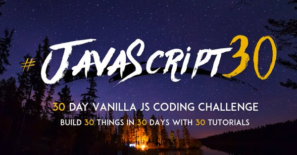

# Drumkit
JavaScript Drum Kit. 
* Catch keyboard-presses and mouse-clicks to play drum sound clips.
* Uses vanilla JavaScript and CSS Flexbox

* Credit goes to wesbos.com [#JavaScript30](https://twitter.com/search?q=%23javascript30)
